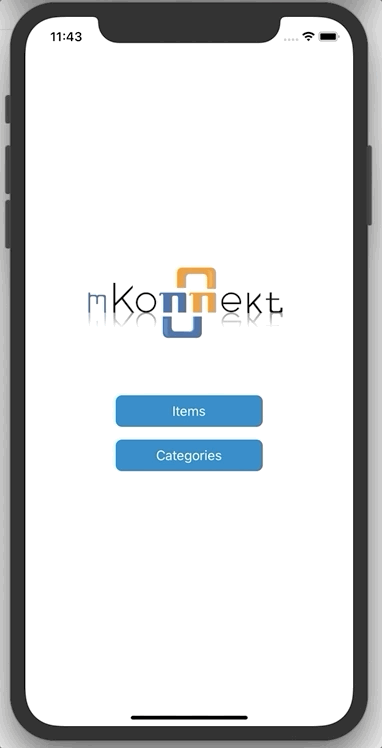

# Menu App 
Simple menu app using react native 

## Demo 

### Installation
1- Make sure you have [react-native cli](https://reactnative.dev/docs/environment-setup) setup ready

2- Clone the repo    
`git clone https://github.com/NabeelZanabeet/menuApp.git`

3- Install node_modules
`yarn`

4- Run metro server 
`yarn start`

5- run android or ios
`yarn run android`
`yarn run ios`

